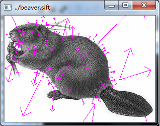
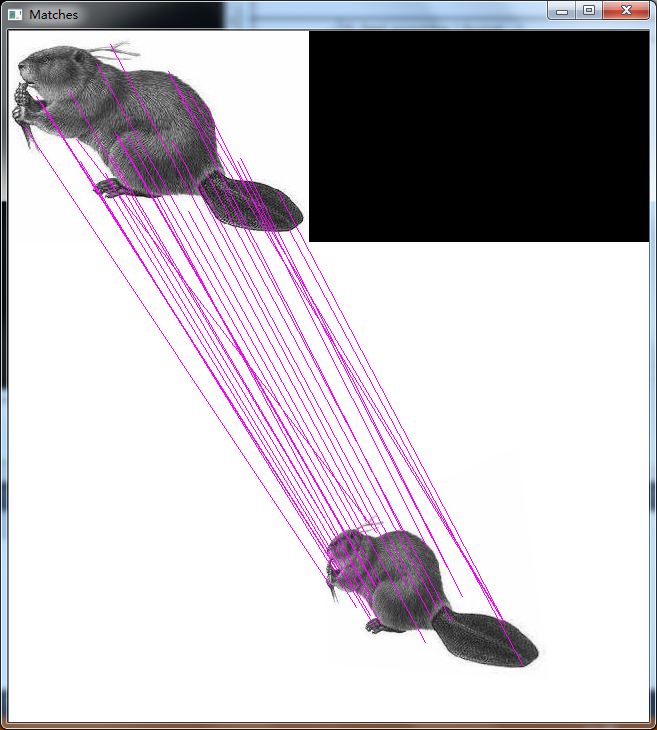

# opensift-for-windows

use opencv 3.0 shared library + visual stuio 2012 IDE

YOU SHOULD CHOOSE x64 RELEASE!!!

**Follows are the outputs:**

---
If you find some questions, please [contact me](lifesider@qq.com]).
